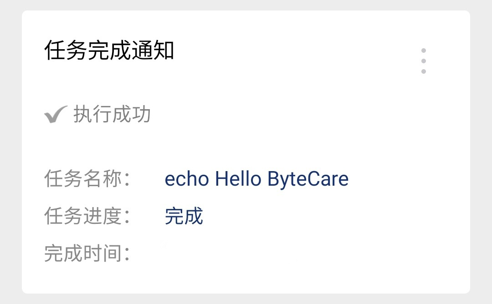
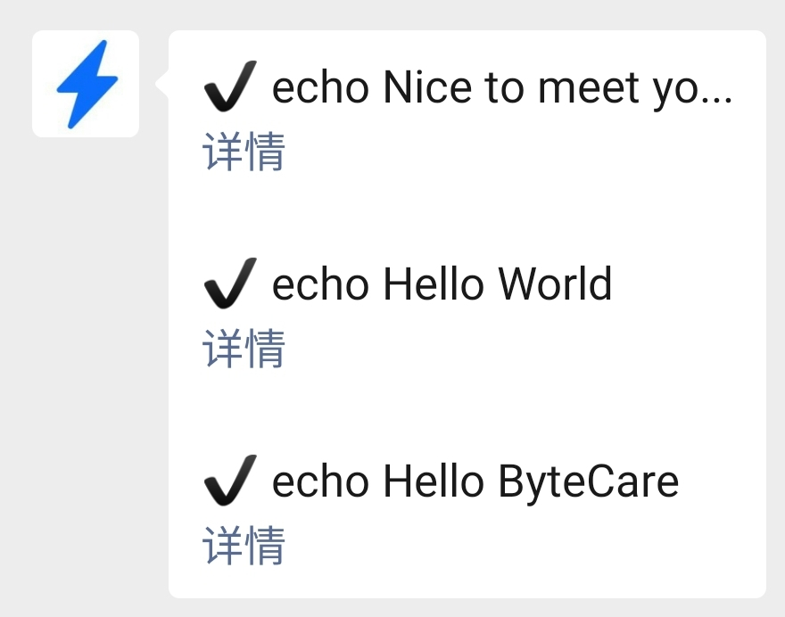
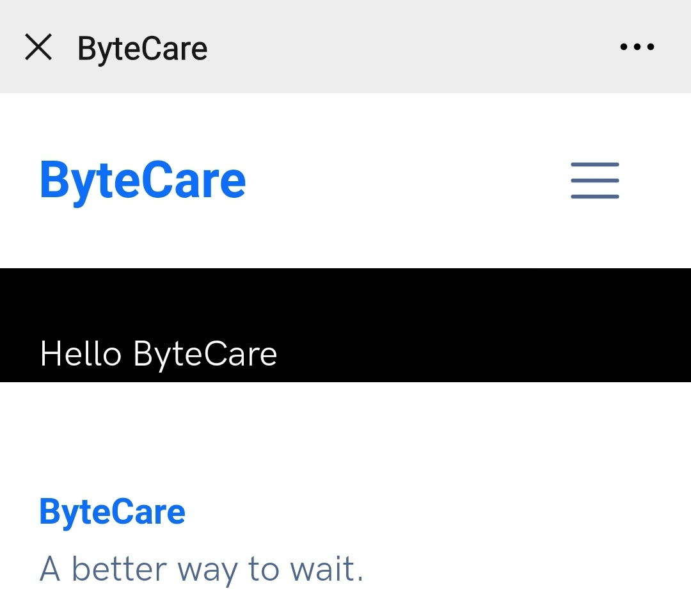

# 设置微信通知

## 快速设置

邮箱通知常会面临系统拦截、延时高、查阅不方便等情况。ByteCare 提供了微信服务号，可查询正在执行的程序，与实时输出。通过如下步骤可设置微信通知。

#### 1. 访问设置页面

访问 [通知方式-微信](https://www.bytecare.xyz/channel-wechat.html) 页面，如果未登录，将被重定向至 GitHub 授权页。

**2. 绑定微信账号**

使用微信扫描页面二维码，关注 ByteCare 服务号，即可绑定微信至当前 ByteCare 账号。

#### 3. **设置默认通知方式**

点击页面右下角 **确认** 按钮，即可将默认通知方式设为微信。

#### 4. 体验微信通知

在命令行中键入如下命令：

```bash
care echo "Hello ByteCare~"
```

如配置正确，命令完成后，您的微信将收到来自服务号的通知：



## 更多功能

您可在 ByteCare 服务号中体验更多功能：

### **任务列表**

点击 ByteCare 服务号下方 **任务列表** 按钮，可获取最新任务状态。



### **实时输出**

点击 任务列表 ****中的 **详情** 按钮，可查看相应任务的实时输出。




